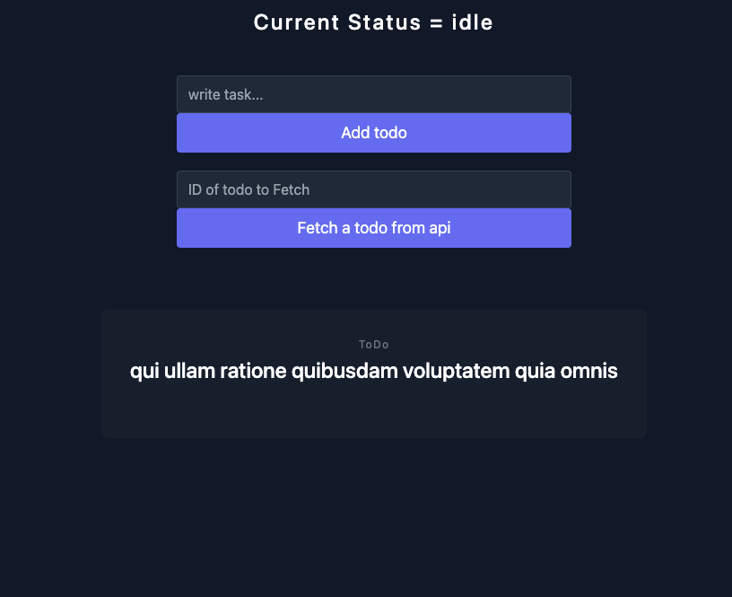
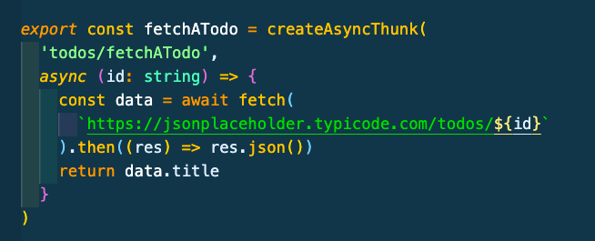
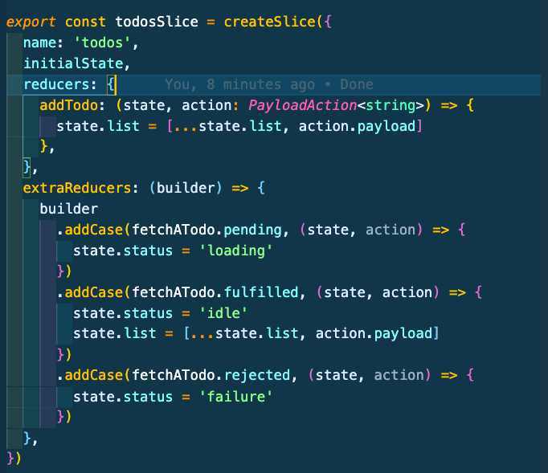
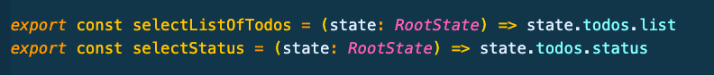

# Redux setup for Next.js project.

This is a mini-project to display a good setup with Redux Toolkit, and how to make an async call to a API with our own Thunk created with `createAsyncThunk`.

## Built With

- [NextJS](https://nextjs.org/)
- [TailwindCSS 3](https://tailwindcss.com/)
- [TypeScript](https://www.typescriptlang.org/)
- [Redux-Toolkit](https://redux-toolkit.js.org/)

## Some "take-aways" are:

- How to create/use `createAsyncThunk`

- How to `handle side-effects` (state.status) while fetching data from API

- How to create/use a `selector`

